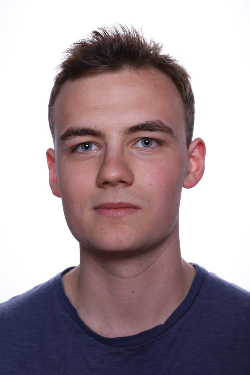
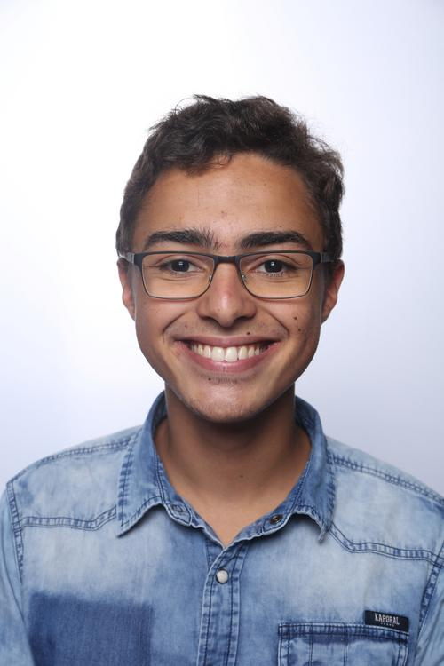
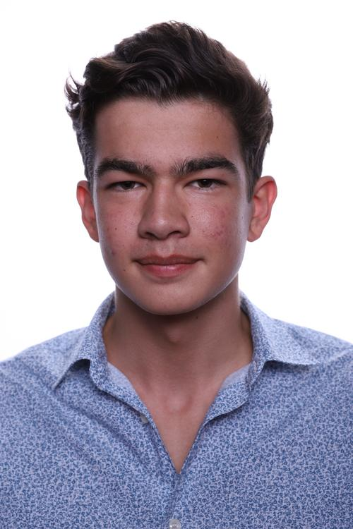

# Main page

This is where you can find all of the NaturlFoundation projets including **naturL** which is the main projet of the Foundation.

## History 

The NaturL Foundation was founded by 4 [EPITA](http://epita.fr) students during the second semester of their first year. It began as a projet assignement and quickly became sort of an obsession. 

We had been taught OCaml a few months earlier and all the founding members had a secret love for the OCaml language, which was kind of a taboo here in EPITA.

The first project we immagined was a new programming language called **abL** (*Abstractly Built Language*) which we abbandoned a few weeks. Later we tried to create a program that could translate french algorithm natural code into python script and thus began our journey to build **naturL**

## Projects

* The first and main project of the Foundation is **naturL** which can be found on github at this [page](https://github.com/TheNaturLFoundation/naturL "page")

* The second project which comes with the first is **idL**, our native integrated developpement environnement which can also be found [here](https://github.com/TheNaturLFoundation/idL)

We plan to expand this project list with **abL** and maybe various projects, written in OCaml

## The team 

Founders : 

